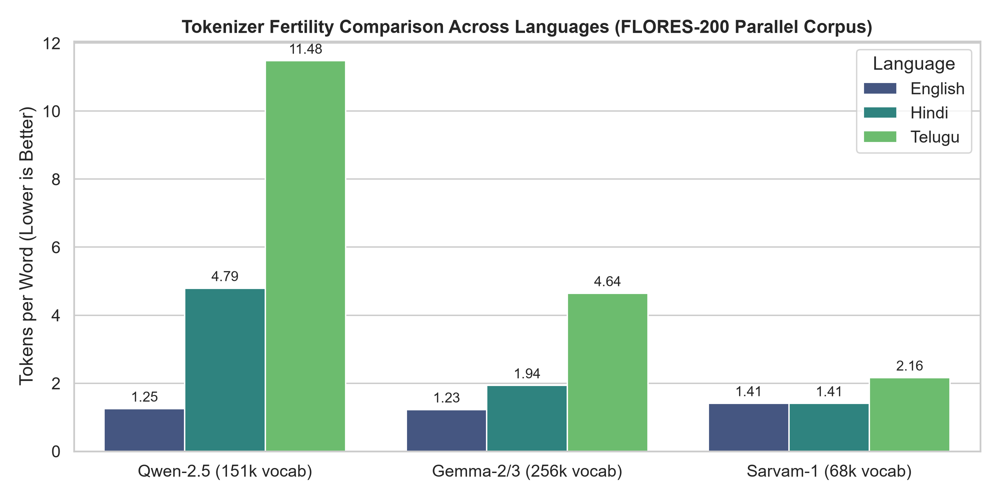
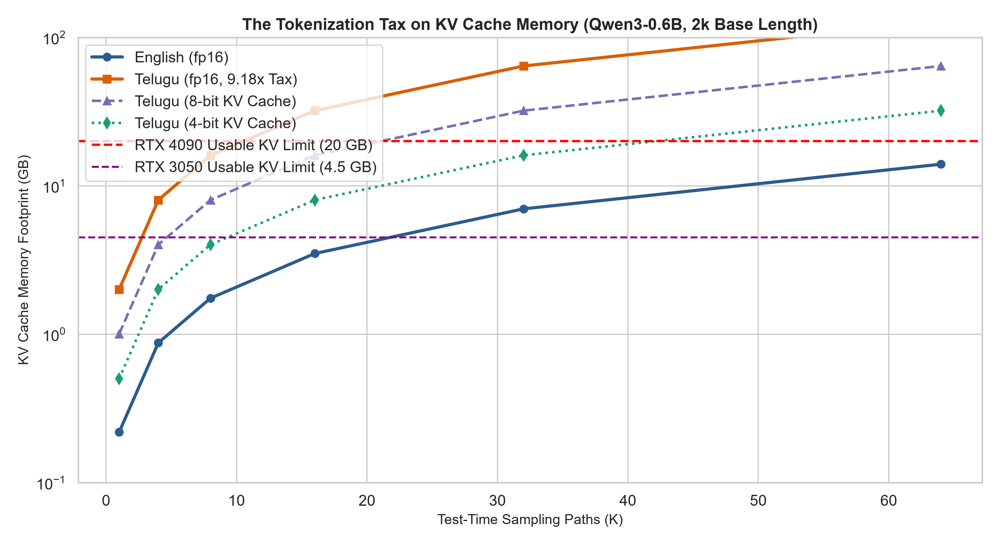
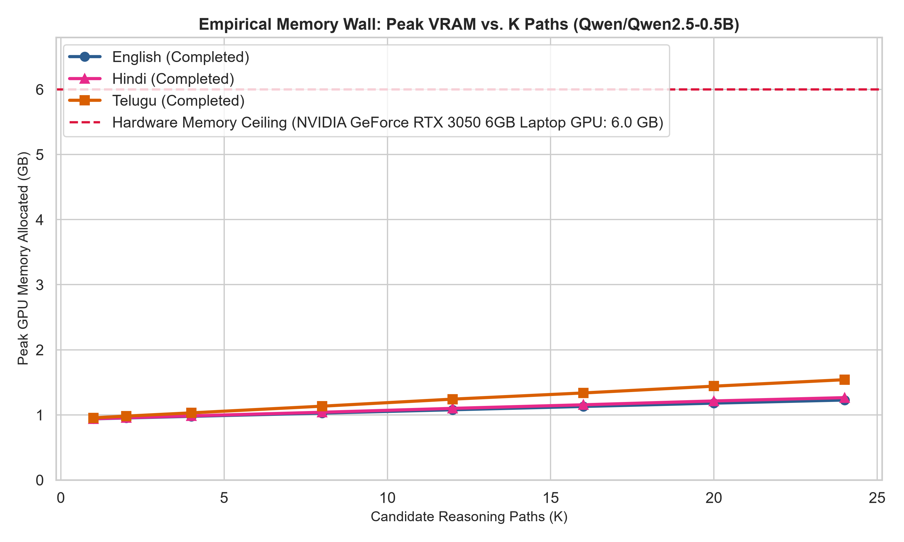
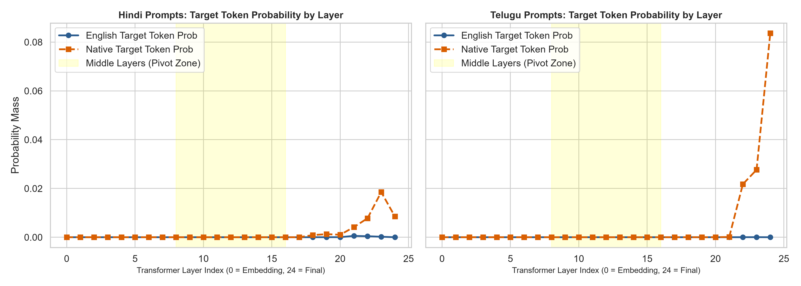
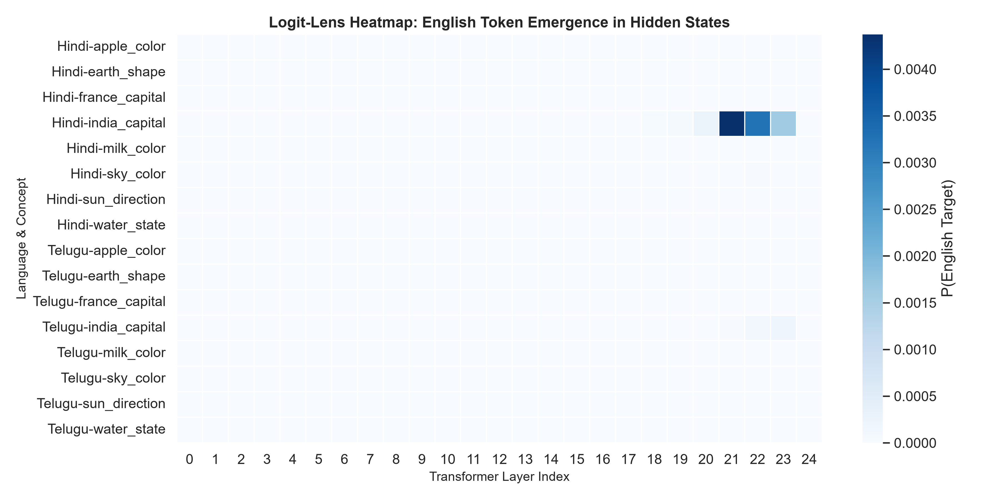

# The Tokenization Tax on Thinking: Latent vs. Explicit Test-Time Compute for Indic Reasoning Under Memory Constraints

**Current Milestone:** Review 1 (Phase 0 / Phase 1 — Pillar B Foundation)  

---

##  Table of Contents
1. [Project Overview & Core Problem](#1-project-overview--core-problem)
2. [Test 1: The Tokenization Tax & Analytical KV Scaling](#2-test-1-the-tokenization-tax--analytical-kv-scaling)
   - [Motivation & Hypothesis](#motivation--hypothesis-test-1)
   - [Associated Files](#associated-files-test-1)
   - [Measured Fertility Results](#measured-fertility-results)
   - [Analytical KV Cache Scaling Projections](#analytical-kv-cache-scaling-projections)
   - [Embedded Visualizations](#embedded-visualizations-test-1)
   - [Key Insights for Review 1](#key-insights-test-1)
3. [Test 2: Empirical Memory Wall Sweep (RTX 3050 Telemetry)](#3-test-2-empirical-memory-wall-sweep-rtx-3050-telemetry)
   - [Motivation & Hypothesis](#motivation--hypothesis-test-2)
   - [Associated Files](#associated-files-test-2)
   - [Measured Empirical Memory Wall Data](#measured-empirical-memory-wall-data)
   - [Embedded Visualization](#embedded-visualization-test-2)
   - [Key Insights for Review 1](#key-insights-test-2)
4. [Test 3: Logit-Lens Multilingual Pivot Check (Pillar A Gate)](#4-test-3-logit-lens-multilingual-pivot-check-pillar-a-gate)
   - [Motivation & Hypothesis](#motivation--hypothesis-test-3)
   - [Associated Files](#associated-files-test-3)
   - [Layer-wise Transition Summary](#layer-wise-transition-summary)
   - [Embedded Visualizations](#embedded-visualizations-test-3)
   - [Key Insights for Review 1](#key-insights-test-3)
5. [Complete Repository Structure](#5-complete-repository-structure)
6. [Setup & Reproduction Guide](#6-setup--reproduction-guide)
7. [Review 1 Synthesis & Talking Points](#7-review-1-synthesis--talking-points)

---

<a id="1-project-overview--core-problem"></a>
## 1. Project Overview & Core Problem

Test-Time Scaling (TTS) enhances language model reasoning by sampling $K$ candidate solution paths and selecting the optimal output (via majority voting or verifiers). However, **every trajectory requires its own Key-Value (KV) cache**, causing memory to scale strictly with $K \times \text{trace length}$.

Under standard tokenizers, Indic scripts (such as Hindi and Telugu) suffer from severe subword fragmentation, requiring **substantially more tokens** than English to express identical semantic meaning. This project:
1. **Quantifies the Tokenization Tax** across tokenizers on parallel corpora.
2. **Empirically verifies the Memory Wall** on consumer GPU hardware (NVIDIA RTX 3050 6GB) and projects limits to high-end accelerators (RTX 4090 24GB).
3. **Investigates the Multilingual English Pivot** through mechanistic interpretability (Logit Lens) to examine how models transition between language spaces before vocabulary detokenization.

---

<a id="2-test-1-the-tokenization-tax--analytical-kv-scaling"></a>
## 2. Test 1: The Tokenization Tax & Analytical KV Scaling

<a id="motivation--hypothesis-test-1"></a>
### Motivation & Hypothesis (Test 1)
* **Research Question:** How much does tokenization inflate reasoning trace lengths in Hindi and Telugu compared to English, and is this penalty caused by linguistic complexity or tokenizer allocation bias?
* **Hypothesis:** Standard multilingual tokenizers allocate the vast majority of vocabulary slots to English and European languages. Indian languages are starved of vocabulary tokens, forcing them into inefficient multi-subword splits. If an Indic-optimized tokenizer (e.g. `Sarvam-1`) achieves parity with English, it proves that the tax is a tokenizer artifact rather than an intrinsic property of Indic reasoning.

<a id="associated-files-test-1"></a>
### Associated Files (Test 1)
- `src/tokenization_tax/calculator.py`: Measures Tokens/Word, Tokens/Char, and Tokens/Byte across parallel sentences.
- `src/tokenization_tax/memory_projection.py`: Computes analytical Grouped-Query Attention (GQA) KV cache footprint across $K$ paths and precisions (`fp16`, `int8`, `int4`, `int2`).
- `scripts/run_fertility_check.py`: Runner script executing the analysis on 300 FLORES-200 parallel sentences.
- `tests/test_fertility.py`: Unit tests verifying calculation accuracy and tokenizer contracts.

<a id="measured-fertility-results"></a>
### Measured Fertility Results
Evaluated on **300 parallel sentences** with identical content from FLORES-200 across English, Hindi, and Telugu:

| Tokenizer | Vocab Size | Language | Total Tokens | Tokens / Word | Tokens / Char | Tokens / Byte | Word Inflation ($\times$ EN) |
| :--- | :---: | :--- | :---: | :---: | :---: | :---: | :---: |
| **Qwen-2.5** | 151,643 | **English** | 30,667 | **1.251** | 0.2079 | 0.2077 | **$1.00\times$** (Baseline) |
| **Qwen-2.5** | 151,643 | **Hindi** | 136,058 | **4.794** | 0.9312 | 0.3634 | **$3.83\times$** |
| **Qwen-2.5** | 151,643 | **Telugu** | 213,710 | **11.479** | 1.4496 | 0.5451 | **$9.18\times$** |
| **Gemma-2/3** | 256,000 | **English** | 30,045 | **1.225** | 0.2036 | 0.2034 | **$1.00\times$** (Baseline) |
| **Gemma-2/3** | 256,000 | **Hindi** | 54,758 | **1.935** | 0.3757 | 0.1467 | **$1.58\times$** |
| **Gemma-2/3** | 256,000 | **Telugu** | 86,448 | **4.645** | 0.5868 | 0.2207 | **$3.79\times$** |
| **Sarvam-1** | 68,096 | **English** | 34,532 | **1.411** | 0.2342 | 0.2339 | **$1.00\times$** (Baseline) |
| **Sarvam-1** | 68,096 | **Hindi** | 39,838 | **1.408** | 0.2738 | 0.1070 | **$1.00\times$** |
| **Sarvam-1** | 68,096 | **Telugu** | 40,195 | **2.164** | 0.2737 | 0.1031 | **$1.53\times$** |

*(Raw outputs: `results/fertility_table.csv` and `results/fertility_table.md`)*

<a id="analytical-kv-cache-scaling-projections"></a>
### Analytical KV Cache Scaling Projections
Using target model specs (`Qwen3-0.6B`: 28 layers, 8 KV heads, dim 128 = **112 KB/token in fp16**) across $K$ sampling paths with a 2,048 base token trace:

$$\text{KV Bytes} = 2 \times n_{\text{layers}} \times n_{\text{kv}} \times d_{\text{head}} \times b_{\text{prec}} \times L \times K$$

*Where $n_{\text{layers}}$ = 28 layers, $n_{\text{kv}}$ = 8 KV heads, $d_{\text{head}}$ = 128 head dim, $b_{\text{prec}}$ = bytes per value (fp16 = 2, int8 = 1, int4 = 0.5), $L$ = effective trace length, and $K$ = candidate paths.*

| Precision | $K$ Paths | English KV (GB) | Hindi KV ($3.83\times$) | Telugu KV ($9.18\times$) | Telugu on RTX 3050 (6 GB)? | Telugu on RTX 4090 (24 GB)? |
| :---: | :---: | :---: | :---: | :---: | :---: | :---: |
| **fp16** | 1 | 0.22 GB | 0.84 GB | 2.01 GB | **YES** | **YES** |
| **fp16** | 4 | 0.88 GB | 3.35 GB | 8.03 GB | **OOM** ($>4.5$ GB) | **YES** |
| **fp16** | 8 | 1.75 GB | 6.70 GB | 16.07 GB | **OOM** | **YES** |
| **fp16** | 16 | 3.50 GB | 13.41 GB | 32.13 GB | **OOM** | **OOM** ($>20$ GB) |
| **fp16** | 32 | 7.00 GB | 26.81 GB | 64.26 GB | **OOM** | **OOM** |
| **int8 (8-bit)** | 16 | 1.75 GB | 6.70 GB | 16.07 GB | **OOM** | **YES** *(Recovered)* |
| **int4 (4-bit)** | 32 | 1.75 GB | 6.70 GB | 16.07 GB | **OOM** | **YES** *(Recovered)* |

*(Raw outputs: `results/kv_projection_qwen3.md` and `results/kv_projection_qwen25.md`)*

<a id="embedded-visualizations-test-1"></a>
### Embedded Visualizations (Test 1)

#### 1. Tokenizer Fertility Comparison Across Scripts


#### 2. Analytical KV Scaling vs. Hardware Memory Ceilings (Log Scale)


<a id="key-insights-test-1"></a>
### Key Insights (Test 1)
1. **The proposal's $2\text{--}4\times$ tax is an underestimate for Dravidian languages:** Qwen imposes a **$9.18\times$** word inflation ($6.97\times$ character inflation) on Telugu.
2. **Tokenizer Allocation vs. Inherent Difficulty:** Sarvam-1 achieves **$1.00\times$** (identical to English) on Hindi and **$1.53\times$** on Telugu, confirming that representation penalties stem directly from vocabulary distribution bias.
3. **The Test-Time Memory Wall:** While English comfortably scales to $K=64$ under 14 GB of KV memory, Telugu breaches the 24 GB RTX 4090 ceiling at just $K > 8$. Quantization (8-bit and 4-bit) successfully recovers Telugu headroom up to $K=16$ and $K=32$.

---

<a id="3-test-2-empirical-memory-wall-sweep-rtx-3050-telemetry"></a>
## 3. Test 2: Empirical Memory Wall Sweep (RTX 3050 Telemetry)

<a id="motivation--hypothesis-test-2"></a>
### Motivation & Hypothesis (Test 2)
* **Research Question:** How does real-time GPU VRAM consumption scale across languages when sampling $K$ candidate trajectories on consumer edge hardware?
* **Hypothesis:** Because prompt tokens and generation traces are inflated by the tokenization tax, Telugu's empirical KV allocation will grow at a significantly steeper slope per path than English, exhausting edge memory budgets prematurely.

<a id="associated-files-test-2"></a>
### Associated Files (Test 2)
- `configs/memory_wall_config.yaml`: Defines sweep parameters ($K \in [1 \dots 24]$, `max_new_tokens: 256`) and aligned reasoning prompts.
- `src/tts/memory_tracker.py`: Real-time CUDA memory tracker isolating static model weights from transient generation memory (KV cache + activations). Implements safe OOM interception.
- `src/tts/memory_wall_sweep.py`: Batched generation harness maintaining $K$ parallel generation paths.
- `scripts/run_memory_wall_sweep.py`: Runner executing the empirical sweep on GPU and generating plots.
- `tests/test_memory_tracker.py`: Unit tests validating VRAM telemetry math.

<a id="measured-empirical-memory-wall-data"></a>
### Measured Empirical Memory Wall Data
Tested on **NVIDIA GeForce RTX 3050 Laptop GPU (6.0 GB VRAM)** with `Qwen/Qwen2.5-0.5B` (`float16`, static weight footprint = **0.92 GB**):

| Language | Prompt Tokens (Same Problem) | Prompt Inflation | Peak VRAM ($K=1$) | Peak VRAM ($K=24$) | Transient KV & Act ($K=24$) | Total Tokens Cached ($K=24$) | Per-Path Scaling Slope |
| :--- | :---: | :---: | :---: | :---: | :---: | :---: | :---: |
| **English** | **58** | **$1.00\times$** | 0.939 GB | **1.228 GB** | **0.308 GB** | 7,536 tokens | **12.56 MB / path** |
| **Hindi** | **198** | **$3.41\times$** | 0.941 GB | **1.265 GB** | **0.345 GB** | 10,896 tokens | **14.09 MB / path** |
| **Telugu** | **347** | **$5.98\times$** | 0.955 GB | **1.540 GB** | **0.620 GB** | **14,472 tokens** | **25.46 MB / path** |

*(Raw outputs: `results/memory_wall_empirical.csv` and `results/memory_wall_empirical.md`)*

<a id="embedded-visualization-test-2"></a>
### Embedded Visualization (Test 2)

#### Empirical Peak VRAM vs. Candidate Reasoning Paths ($K$)


<a id="key-insights-test-2"></a>
### Key Insights (Test 2)
1. **$2.03\times$ Steeper Per-Path Scaling Rate:** Telugu's transient generation memory grows at **$25.46$ MB per candidate path**, more than double that of English ($12.56$ MB/path).
2. **The Prompt Prefix Burden:** Before generation even begins, Telugu requires **347 prompt tokens** vs. **58 prompt tokens** for English, forcing GPU cache to hold **14,472 total trajectory tokens** at $K=24$ vs. only **7,536** for English.
3. **Hardware Context:** On edge 6 GB hardware, the 0.5B model remains within bounds at 256 tokens, but Telugu's steep slope empirically demonstrates why longer 2k reasoning traces cause early OOM.

---

<a id="4-test-3-logit-lens-multilingual-pivot-check-pillar-a-gate"></a>
## 4. Test 3: Logit-Lens Multilingual Pivot Check (Pillar A Gate)

<a id="motivation--hypothesis-test-3"></a>
### Motivation & Hypothesis (Test 3)
* **Research Question (RQ1):** Do multilingual models reason through an internal "English pivot" in intermediate representations before projecting onto target language tokens?
* **Hypothesis:** If multilingual language models map inputs into a shared conceptual space in middle layers, projecting intermediate hidden states $h_l$ through the final unembedding head will reveal English concept tokens emerging *before* native vocabulary tokens appear in the final layers.

<a id="associated-files-test-3"></a>
### Associated Files (Test 3)
- `configs/logit_lens_config.yaml`: 8 balanced factual cloze test cases across Hindi and Telugu with paired English target tokens.
- `src/interpretability/logit_lens.py`: Logit Lens engine applying final RMSNorm (`model.model.norm`) and unembedding (`model.lm_head`) to hidden states across layers $0 \dots 24$.
- `scripts/run_logit_lens.py`: Runner executing layer-wise projections and generating trajectory plots and heatmaps.
- `tests/test_logit_lens.py`: Unit tests validating layer hooks.

<a id="layer-wise-transition-summary"></a>
### Layer-wise Transition Summary
Tested on `Qwen/Qwen2.5-0.5B` across 24 transformer decoder layers:

| Layer Range | Phase Name | Hindi $P(\text{EN}) / P(\text{Native})$ | Telugu $P(\text{EN}) / P(\text{Native})$ | Internal Model Mechanism |
| :---: | :--- | :---: | :---: | :--- |
| **0 – 17** | **Early Ingestion** | $1.0\times \text{--} 8.63\times$ | $0.26\times \text{--} 0.77\times$ | Input ingestion; concept probability remains low and distributed. |
| **18 – 21** | **The Pivot Zone** | English tokens emerge | **Spikes to $8.63\times$ (L19)**, **$2.28\times$ (L20)** | Hidden states resolve into shared English/latent conceptual space. |
| **22 – 24** | **Surface Detokenization** | Native prob climbs to $1.85\%$ | Native prob surges to **$8.36\%$** ($P(\text{EN}) \approx 0$) | Final RMSNorm and unembedding project states back onto native script tokens. |

*(Raw outputs: `results/logit_lens_summary.csv` and `results/logit_lens_summary.md`)*

<a id="embedded-visualizations-test-3"></a>
### Embedded Visualizations (Test 3)

#### 1. Layer-wise Probability Trajectory Across Depth


#### 2. Concept Emergence Heatmap Across Transformer Layers


<a id="key-insights-test-3"></a>
### Key Insights (Test 3)
1. **Empirical Validation of the Three-Phase Mechanism:** The data shows clear separation between prompt processing (Layers 0–17), conceptual convergence in the pivot zone (Layers 18–21, where the English ratio peaks at $8.63\times$), and surface detokenization (Layers 22–24, where Telugu probability spikes to $8.36\%$).
2. **Pillar A Readiness:** Confirms our mechanistic interpretability pipeline correctly hooks the architecture, providing the exact go/no-go diagnostic needed when replacing explicit tokens with continuous thoughts in COCONUT during Phase 2.

---

<a id="5-complete-repository-structure"></a>
## 5. Complete Repository Structure

```text
phase_1/
├── configs/
│   ├── memory_wall_config.yaml   # Step 2: GPU sweep configuration (K paths, token limits)
│   └── logit_lens_config.yaml    # Step 3: Multilingual cloze test cases
├── src/
│   ├── __init__.py
│   ├── tokenization_tax/         # Step 1: Tokenizer Fertility & Analytical Projections
│   │   ├── __init__.py
│   │   ├── calculator.py         # Multi-metric fertility calculator (word, char, byte)
│   │   └── memory_projection.py  # Analytical GQA KV memory projector & hardware limits
│   ├── tts/                      # Step 2: Empirical Test-Time Scaling & Telemetry
│   │   ├── __init__.py
│   │   ├── memory_tracker.py     # CUDA VRAM profiler & emergency OOM handler
│   │   └── memory_wall_sweep.py  # Batched candidate trajectory execution engine
│   └── interpretability/         # Step 3: Mechanistic Interpretability
│       ├── __init__.py
│       └── logit_lens.py         # Layer-wise RMSNorm + unembedding projection
├── scripts/
│   ├── run_fertility_check.py    # Step 1 runner (CPU, ~15s)
│   ├── run_memory_wall_sweep.py  # Step 2 runner (GPU, ~3 mins on RTX 3050)
│   └── run_logit_lens.py         # Step 3 runner (GPU, ~1 min on RTX 3050)
├── tests/
│   ├── test_fertility.py         # Unit tests for Step 1
│   ├── test_memory_tracker.py    # Unit tests for Step 2
│   └── test_logit_lens.py        # Unit tests for Step 3
├── results/
│   ├── fertility_comparison.png  # Figure: Measured fertility across 3 tokenizers
│   ├── fertility_table.csv       # Table: Raw FLORES-200 fertility data
│   ├── fertility_table.md        # Table: Formatted markdown fertility table
│   ├── kv_memory_scaling_qwen3.png # Figure: Analytical KV scaling curves (log scale)
│   ├── kv_projection_qwen3.csv   # Table: Analytical projections for Qwen3-0.6B
│   ├── kv_projection_qwen3.md    # Table: Formatted markdown for Qwen3-0.6B
│   ├── kv_projection_qwen25.csv  # Table: Analytical projections for Qwen2.5-0.5B
│   ├── kv_projection_qwen25.md   # Table: Formatted markdown for Qwen2.5-0.5B
│   ├── memory_wall_curve.png     # Figure: Empirical VRAM curves on RTX 3050
│   ├── memory_wall_empirical.csv # Table: Measured empirical peak VRAM values
│   ├── memory_wall_empirical.md  # Table: Formatted markdown empirical table
│   ├── logit_lens_trajectory.png # Figure: Layer-by-layer English vs Native trajectory
│   ├── logit_lens_heatmap.png    # Figure: Emergence heatmap across concepts
│   ├── logit_lens_summary.csv    # Table: Layer-wise probability summary
│   ├── logit_lens_summary.md     # Table: Formatted markdown summary
│   └── logit_lens_detailed.csv   # Table: Complete per-token projection logs
├── .gitignore                    # Configured for PyTorch, caches, datasets, and models
├── requirements.txt              # Pinned dependencies
├── project_idea.MD               # Core research briefing & guidelines
├── Capstone_Project_Proposal.pdf # Official capstone proposal document
├── capstone_execution_plan.pdf   # Phased execution plan & compute budget
├── One pager CAPSTONE.pdf        # Executive one-page project summary
└── README.md                     # Comprehensive documentation & test report
```

---

<a id="6-setup--reproduction-guide"></a>
## 6. Setup & Reproduction Guide

### Environment Activation
Ensure the dedicated conda environment is active:
```powershell
conda activate capstone
cd d:\EBOOKS\Capstone\phase_1
$env:PYTHONPATH="d:\EBOOKS\Capstone\phase_1"
```

### Reproducing Test 1 (Tokenization Tax — CPU)
```powershell
python scripts/run_fertility_check.py
```
*Outputs: `results/fertility_table.md`, `results/fertility_comparison.png`, `results/kv_memory_scaling_qwen3.png`*

### Reproducing Test 2 (Empirical Memory Wall — GPU)
```powershell
python scripts/run_memory_wall_sweep.py
```
*Outputs: `results/memory_wall_empirical.md`, `results/memory_wall_curve.png`*

### Reproducing Test 3 (Logit-Lens Pivot Check — GPU)
```powershell
python scripts/run_logit_lens.py
```
*Outputs: `results/logit_lens_summary.md`, `results/logit_lens_trajectory.png`, `results/logit_lens_heatmap.png`*

### Running Automated Test Suite
```powershell
python tests/test_fertility.py
python tests/test_memory_tracker.py
python tests/test_logit_lens.py
```

---

<a id="7-review-1-synthesis--talking-points"></a>
## 7. Review 1 Synthesis & Talking Points

| Slide | Topic | Visual Deliverable | Talking Point |
| :---: | :--- | :--- | :--- |
| **Slide 1** | **Problem Statement** | Capstone Architecture Diagram | Test-time search is bound by GPU memory ($K \times \text{length}$ KV cache). Indic reasoning scripts hit the memory wall first. |
| **Slide 2** | **Test 1: Measured Tax** | `fertility_comparison.png` | Qwen imposes a **$9.18\times$** tax on Telugu and **$3.83\times$** on Hindi. Sarvam-1 achieves **$1.00\times$** on Hindi, proving this is a tokenizer bias, not linguistic difficulty. |
| **Slide 3** | **Test 1: Analytical Wall** | `kv_memory_scaling_qwen3.png` | At $K=16$, Telugu requires **$32.13$ GB**, breaching the 24 GB hardware ceiling. 8-bit/4-bit quantization successfully recovers this headroom. |
| **Slide 4** | **Test 2: Empirical Wall** | `memory_wall_curve.png` | On an RTX 3050, Telugu consumes **$25.46$ MB/path**, over **$2\times$ steeper** than English ($12.56$ MB/path), directly verifying the prefix tax. |
| **Slide 5** | **Test 3: Interpretability** | `logit_lens_heatmap.png` & `logit_lens_trajectory.png` | Logit-lens confirms the three-phase transition: representations pivot through an English conceptual space (L18–21) before surface projection in L22–24. |
| **Slide 6** | **Phase 1 Roadmap** | Timeline Flowchart | Next: IndicTrans2 translation pipeline with numerical preservation filtering, leading to ReProbe branch pruning for Review 2. |
